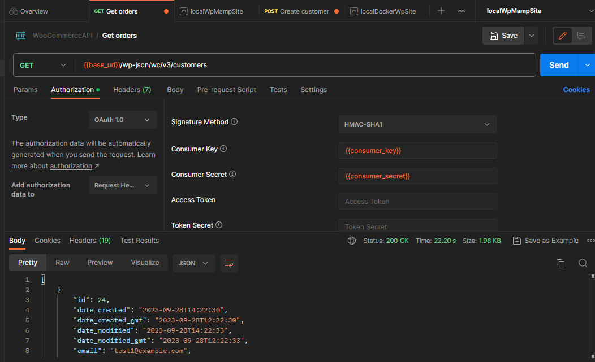
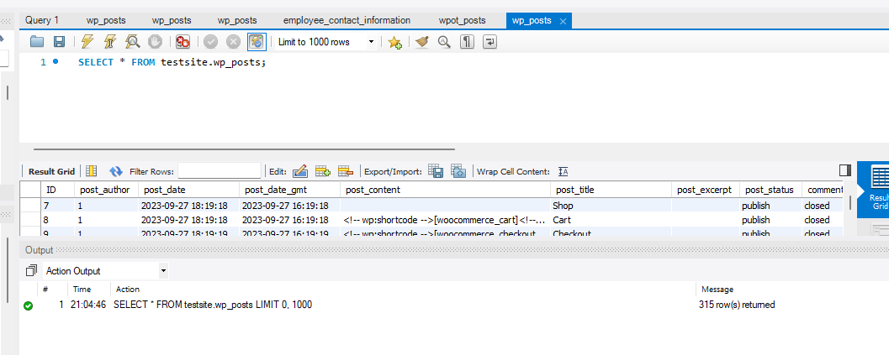

# apiPythonMB

## Technologies Used in This Project:
- Python
- Pytest
- PyMySQL
- Requests
- Docker
- WooCommerce

### For security reasons, personal configurations are not shared on this public repository. To set up and run the project, please follow the instructions below.

## How to Launch This Project

### 1. Get your own WordPress site
You'll need a WordPress site where you have all permissions and can change/get everything. If you don't have one, you can create a local WordPress site by following the instructions in [this documentation](https://github.com/MaartinBo/docLocalWpSite).

### 2. Change your WordPress and Site Address URLs
Change your WordPress address and site address URLs to your local IP address. You can find your local IP address [here](https://www.avast.com/c-how-to-find-ip-address). We recommend using the following format for your site URL: `http://yourInternaliIp:port/site`, for example: `http://192.158.1.38:3336/testsite`. This setup will help you with API authorization.

### 3. Verify Everything Works as Expected
Make sure everything works as it should. For example, test your setup by sending requests in Postman:

#### Postman Configuration:
- Method: GET
- URL: `{{yourwebsiteInTheFormat}}/wp-json/wc/v3/customers`



Also, check the database connection by executing a simple query:

#### Database Query:
```sql
SELECT * FROM testsite.wp_posts;
```




### 4. Fill the configuration files with your site/db info and install packages:

`env.bat` or `env.sh` depends on your system/terminal

and

`mbtest\src\configs\host_config.py ` 

Then after that you need to install packages through the command:

`python setup.py install`

### 5. Launch tests

Last step before launch you need to set your env variables by command:

`source env.sh` or `.\env.bat` depends on your system/terminal.

Then launch test through the command, for example:

`pytest`

`pytest -m smoke`

`pytest -m orders`

