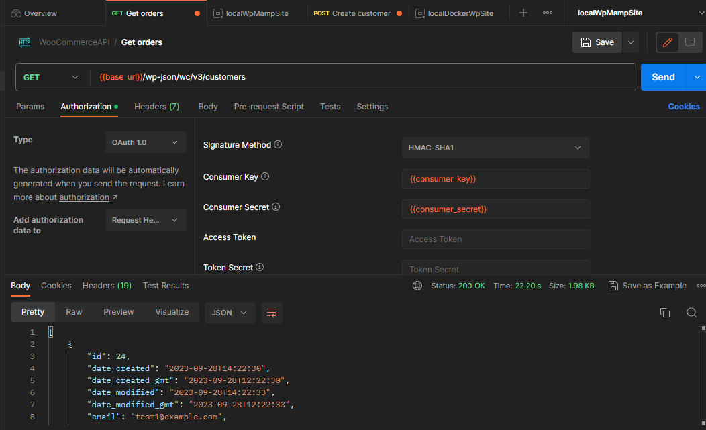
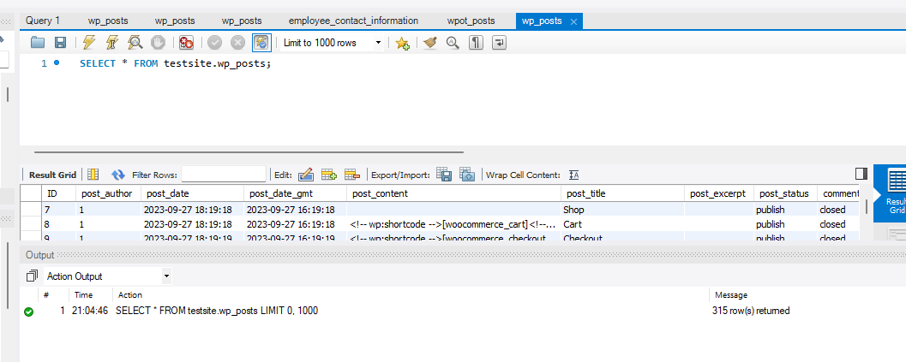

# apiPythonMB

## Technologies Used in This Project:

- Python
- Pytest
- PyMySQL
- Requests
- Docker
- WooCommerce

### For security reasons, personal configurations are not shared on this public repository. To set up and run the project, please follow the instructions below.

## How to Launch This Project

### 1. Get your own WordPress site

You'll need a WordPress site where you have all permissions and can change/get everything. If you don't have one, you
can create a local WordPress site by following the instructions
in [this documentation](https://github.com/MaartinBo/docLocalWpSite).

### 2. Change your WordPress and Site Address URLs

Change your WordPress address and site address URLs to your local IP address on `yoursite/wp-admin/options-general.php`
You can find your local IP address [here](https://www.avast.com/c-how-to-find-ip-address).
I recommend using the following format for your site URL: `http://yourInternaliIp:port/site`, for
example: `http://192.158.1.38:3336/testsite`. This setup will help you with API authorization and docker connection.

### 3. Verify Everything Works as Expected

Make sure everything works as it should. For example, test your setup by sending requests in Postman:

#### Postman Configuration:

- Method: GET
- URL: `{{yourwebsiteInTheFormat}}/wp-json/wc/v3/customers`



Also, check the database config by login into the db and by executing a simple query:

#### Database Query:

```sql
SELECT * FROM testsite.wp_posts;
```



### 4. Fill the configuration files with your site/db info and install packages:

`env.bat` or `env.sh` depends on your system/terminal.
You only need to fill the `WC_KEY`,`WC_SECRET`, `DB_USER`, `DB_PASSWORD` in this file.

If you don't know how to find WC_KEY and WC_SECRET follow the instruction
on [this documentation](https://github.com/MaartinBo/docLocalWpSite).

```
export Machine=machine1
export WP_host=mamp

export WC_KEY=ck_yourKEY
export WC_SECRET=cs_yourKEY

export DB_USER=yourUser
export DB_PASSWORD=yourPassword
```

Then you need to also fill the configuration on this file:

`mbtest\src\configs\host_config.py `

After that, you need to install packages through the command. I recommend using this:

`pip install -e .`

This will install the package in "editable" mode, allowing you to make changes to the code, if necessary.

### 5. Launch tests

Last step before launch you need to set your env variables by command:

`source env.sh` or `.\env.bat` depends on your system/terminal.

Then launch test through the command, for example:

`pytest`

`pytest -m smoke`

`pytest -m orders`

### 5.1 Launch tests in docker container

You can also launch these tests in docker container:

Follow all the previous steps but in point 4 instead of:

`env.bat` or `env.sh` depends on your system/terminal

use/fill `env_docker.bat` or `env_docker.sh`

make sure the `mbtest\src\configs\host_config.py ` contains `'docker': {
"test": {
"host": "host.docker.internal",` it is required to connect into docker container.

Then:

1. Build the Docker image using the command: `docker build -t mbtest_api_python .`.

2. Run the startup script with all variables by executing either `bash run_in_docker.sh` or `.\run_in_docker.bat`, depends on your system/terminal.

3. You can find the report in `mbtest/reports` folder.

4. Enjoy if you've made it this far :) Any feedback is welcome :)
